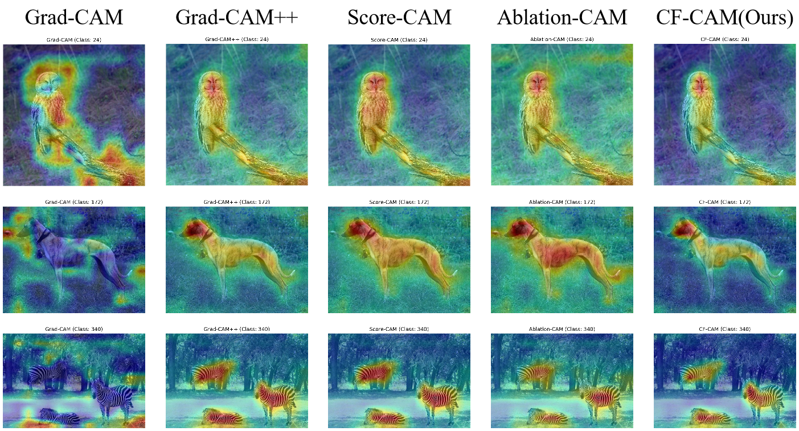

# CFCAM

`ClusteredFilteredGradCAM` is an enhanced Class Activation Mapping (CAM) method designed to produce more precise and smoother heatmaps for interpreting deep learning model decisions. Building upon the foundation of Grad-CAM, it incorporates DBSCAN clustering and Guided Filter to refine feature map and gradient processing, thereby improving the quality of CAM visualizations.

## Workflow for Generating CAM Heatmaps

The following outlines the complete steps of `ClusteredFilteredGradCAM` to generate a heatmap:

### 1. **Model Initialization and Hook Registration**
- **Input**: A pretrained deep learning model (e.g., ResNet50) and a target layer (typically the last convolutional layer, such as `layer3[-1]`).
- **Process**: 
  - Register a forward hook on the target layer to capture feature maps (`feature_maps`).
  - Register a backward hook on the target layer to capture gradients (`gradients`).
- **Purpose**: Collect activation and gradient information from the target layer for subsequent computations.

### 2. **Image Preprocessing**
- **Input**: Image path (e.g., `../input/zebra.jpg`).
- **Process**: 
  - Resize the image to 224x224.
  - Convert it to a tensor and apply ImageNet normalization (mean `[0.485, 0.456, 0.406]`, std `[0.229, 0.224, 0.225]`).
- **Output**: Input tensor (`input_tensor`) and the original image (for later superimposition).

### 3. **Forward Pass and Class Prediction**
- **Process**: 
  - Pass the input tensor through the model to obtain output logits.
  - If no target class (`class_idx`) is specified, select the class with the highest score.
- **Output**: Target class index (e.g., predicted class ID).

### 4. **Backward Pass**
- **Process**: 
  - Create a one-hot vector with a 1 at the target class position.
  - Perform backpropagation to compute gradients of the target layer with respect to the target class.
- **Output**: Feature maps (`feature_maps`) and gradients (`gradients`), both with shape `(C, H, W)`.

### 5. **Feature Map Clustering**
- **Method**: Use DBSCAN (Density-Based Spatial Clustering of Applications with Noise) to group feature map channels.
- **Process**: 
  - Flatten feature maps into a `(C, H*W)` matrix.
  - Compute the Euclidean distance matrix between channels.
  - Adaptively estimate DBSCAN parameters:
    - `eps`: 25th percentile of the distance matrix.
    - `min_samples`: 5% of the number of channels (minimum of 2).
  - Perform DBSCAN clustering to obtain cluster labels (`cluster_labels`) and the number of clusters (`n_clusters`).
- **Purpose**: Group semantically similar channels for differentiated processing.

### 6. **Gradient Filtering**
- **Method**: Apply Guided Filter to smooth gradients.
- **Process**: 
  - For each cluster:
    - Extract the gradients of that cluster (`cluster_gradients`).
    - Compute the mean gradient within the cluster (`mean_cluster_gradient`).
    - Adaptively estimate Guided Filter parameters:
      - Radius `r`: One-fourth of the feature map's spatial scale.
      - Regularization `eps`: 10% of the gradient variance.
    - Apply Guided Filter to produce a smoothed gradient (`filtered_mean_gradient`).
    - Assign the filtered gradient to all channels in the cluster.
- **Output**: Smoothed gradient tensor (`filtered_gradients`).
- **Purpose**: Reduce noise while preserving edges, enhancing the smoothness and interpretability of the CAM.

### 7. **Weight Calculation and CAM Generation**
- **Process**: 
  - Perform global average pooling on the smoothed gradients to obtain per-channel weights (`weights`).
  - Compute a weighted sum of the feature maps using these weights to generate the initial CAM.
  - Apply ReLU (`torch.clamp(min=0)`) to remove negative values.
  - Normalize to the range [0, 1] (if the maximum value is greater than 0).
- **Output**: CAM heatmap (`cam`), with shape `(H, W)`.

### 8. **Heatmap Visualization**
- **Process**: 
  - Upsample the CAM to the original image size (e.g., 224x224).
  - Convert the CAM to a JET colormap heatmap using `cv2.applyColorMap`.
  - Superimpose the heatmap (40% weight) onto the original image (60% weight).
- **Output**: Superimposed heatmap (`superimposed_heatmap`), saved as a PNG file.

---

## Code Overview
- **File**: `cfcam.py`
- **Dependencies**: PyTorch, Torchvision, NumPy, Matplotlib, OpenCV, scikit-learn.
- **Fine-tuned ResNet50 weight**: `https://drive.google.com/file/d/1_Vq50KGmSp0PNyY-a_nmQjF2eIXHqUht/view?usp=sharing`
