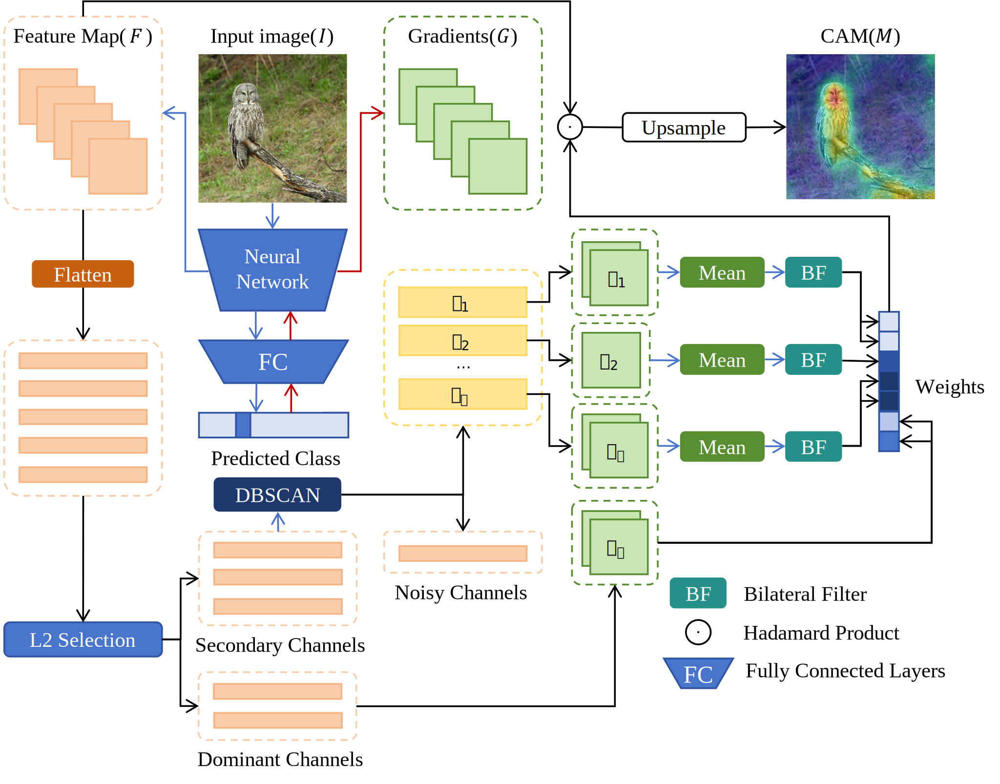

# CF-CAM: Cluster Filter Class Activation Mapping
---


CF-CAM (Cluster Filter Class Activation Map) is an enhanced Class Activation Mapping (CAM) technique that improves the interpretability of deep neural networks by mitigating gradient perturbation and stabilizing feature maps. It extends Grad-CAM by introducing **density-aware feature clustering (DBSCAN)** and **cluster-conditioned gradient filtering (bilateral filtering)**, resulting in more precise and robust heatmaps.

## Key Features
- **Density-Aware Channel Clustering**: Uses DBSCAN to group semantically similar feature channels while eliminating noise-prone activations.
- **Cluster-Conditioned Gradient Filtering**: Applies bilateral filtering within clusters to refine gradient signals and enhance spatial coherence.
- **Hierarchical Importance Weighting**: Balances discriminative feature retention and noise suppression for faithful interpretability.

---

## Installation & Setup

### 1. Install Dependencies
Ensure you have Python installed (>=3.8). Then, install the required libraries:
```sh
pip install -r requirements.txt
```

### 2. Download Pretrained Model Weights
Download the fine-tuned ResNet50 model from Google Drive:

[Pretrained Model Weights](https://drive.google.com/file/d/1_Vq50KGmSp0PNyY-a_nmQjF2eIXHqUht/view?usp=sharing)
[Shenzhen Hospital X-Ray Set](https://github.com/openmedlab/Awesome-Medical-Dataset/blob/main/resources/Shenzhen_chest_X-ray.md)

Place the downloaded weight file in the **root directory** of this project. For the dataset, place the "CXR_png" folder in the **root directory**.

### 3. Prepare Input Images
Put test images inside the `testimgs/` folder. Ensure that images are in common formats (e.g., `.jpg`, `.png`).

### 4. Run CF-CAM
Execute the following command to generate CAM heatmaps:
```sh
python CF-CAM.py
```

The generated heatmaps will be saved in the `output/` directory.

---

## CF-CAM Workflow

### 1. **Model Initialization & Hook Registration**
- Loads a pre-trained model (e.g., ResNet50) and selects a target convolutional layer (e.g., `layer4[-1]`).
- Registers forward and backward hooks to capture **feature maps** and **gradients**.

### 2. **Image Preprocessing**
- Loads an input image and resizes it to **224×224**.
- Converts the image to a **tensor** and applies ImageNet normalization:
  ```python
  mean = [0.485, 0.456, 0.406]
  std = [0.229, 0.224, 0.225]
  ```

### 3. **Forward Pass & Class Prediction**
- Runs the model on the input image.
- If no target class is specified, selects the **top predicted class** automatically.

### 4. **Backward Pass**
- Computes gradients of the target class with respect to the feature maps of the selected layer.

### 5. **Feature Map Clustering (DBSCAN)**
- Flattens feature maps into a `(C, H*W)` matrix.
- Computes the **Euclidean distance matrix** between feature channels.
- Uses **adaptive DBSCAN clustering**:
  - `eps = 25th percentile of distance matrix`
  - `min_samples = max(2, 5% of total channels)`
- Clusters semantically related channels and removes outliers (noise channels).

### 6. **Gradient Filtering (Bilateral Filter)**
- For each cluster:
  - Computes the **mean gradient** of the channels.
  - Applies **bilateral filtering** to preserve spatial coherence.
  - Uses filtered gradients to enhance interpretability.

### 7. **Weight Calculation & CAM Generation**
- Performs **global average pooling** on filtered gradients.
- Computes **weighted sum** of feature maps.
- Applies **ReLU activation** (`torch.clamp(min=0)`) and normalizes the heatmap.

### 8. **Heatmap Visualization & Superimposition**
- Upsamples the CAM heatmap to match the original image size.
- Converts CAM to a heatmap using OpenCV.
- Superimposes the heatmap onto the input image (`40% heatmap + 60% original`).
- Saves the final visualization to `output/`.
